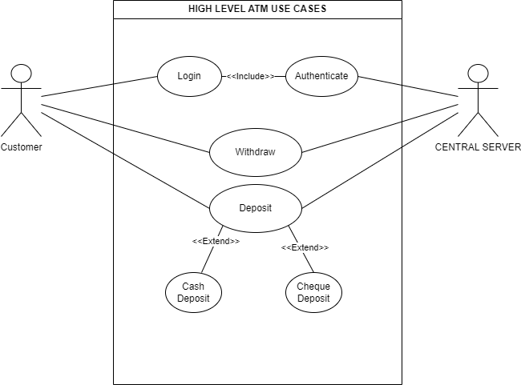
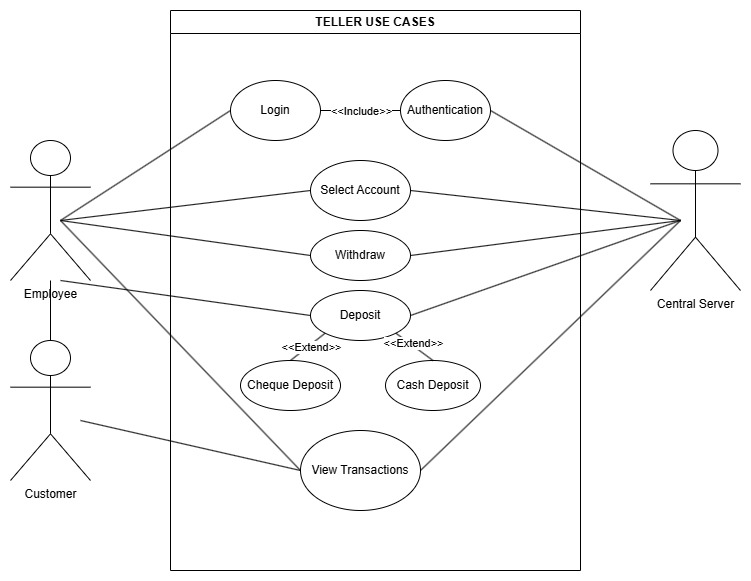
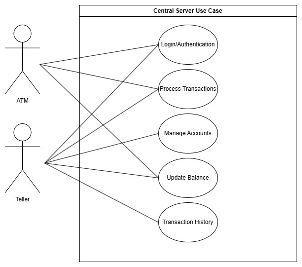

Here are the use cases for our Banking System Application which consists of 3 main utilities: ATM, Teller, and a Central Server.
  

ATM Use Case:  

  

Teller Use Case:  

  

Central Use Case:  

 
